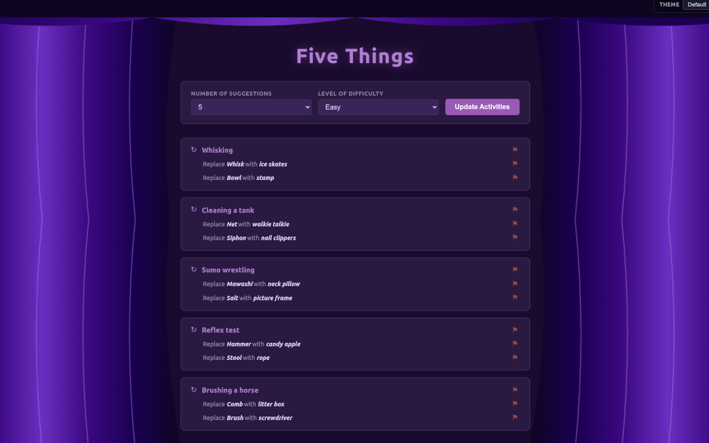

# 🎭 Five Things

> An improv warm-up tool for mime-and-guess practice — activities, items, locations, and people, all randomized and session-aware.

[](./app/package.json)
[](https://nodejs.org)
[](./Dockerfile)
[](./LICENSE)

**Live:** [fivethings.techietable.com](https://fivethings.techietable.com/)

---

## What is Five Things?

One player mimes an activity — without actually doing it. The other mimes guesses until they perform it.

Five Things generates the prompts: a random activity, two substitutions (items, a location, or a person to weave in), and a difficulty level to keep things fresh. It tracks what's been shown in the session so nothing repeats.

---

## Features

- **Three difficulty levels** — Easy, Medium, Hard, and Random (pulls across all pools)
- **Smart substitutions** — activities come paired with items, locations, or persons to mime alongside
- **Session-aware** — no activity, location, or person repeats until you reload
- **Flag for review** — mark anything that needs fixing; logged to a flat file for later
- **Theater curtain** — animated SVG curtain opens on load, pauses on interaction
- **Light / dark mode** — follows your OS preference
- **Mobile-friendly** — works on phones at the table
- **Keyboard accessible** — full keyboard navigation

---

## Screenshots



---

## Getting Started

### Docker (recommended)

```bash
# Set version and name
export IMAGE_VERSION=0.0.11
export IMAGE_NAME=fivethings

docker compose up --build
```

The app will be available at **http://localhost**.

Data (CSV files and logs) is mounted from `./data` — edit the CSVs there to customize your activity pool.

### Local development

```bash
cd app
npm install
NODE_ENV=development npm run dev
```

Runs on **http://localhost:3000** with live reload.

---

## Data Files

All data lives in `./data/` and is mounted into the container:

| File | Contents |
|---|---|
| `easy.csv` | Easy activities |
| `medium.csv` | Medium activities |
| `hard.csv` | Hard activities |
| `replacements.csv` | Item substitutions by difficulty |
| `locations.csv` | Location substitutions by difficulty |
| `persons.csv` | Person substitutions by difficulty |
| `flagged.log` | Flagged entries (appended, plain text) |

### Activity file format

```
Name,With,Against,Item1,Item2,Item3,Item4,Item5,Item6
Juggling,false,false,ball,club,ring,hat,torch,unicycle
```

### Replacements / Locations / Persons format

```
Replacement,Difficulty,Category
frying pan,EASY,Kitchen & Cooking
```

---

## Configuration

Key defaults (set in the server and front end):

| Setting | Default |
|---|---|
| Suggestions shown | 5 |
| Default difficulty | Easy |
| Location substitution rate | 20% |
| Person substitution rate | 20% |
| Curtain open time | 5s |
| Log file | `flagged.log` |

---

## Flag Log Format

Each flagged row appends one line:

```
# Activity name
[timestamp] difficulty=easy activity[12]=Juggling flagged=name

# Item / replacement
[timestamp] difficulty=easy activity[12]=Juggling item=ball replacement[44]=frying pan

# Location
[timestamp] difficulty=easy activity[12]=Juggling location[18]=Eiffel Tower

# Person
[timestamp] difficulty=easy activity[12]=Juggling person[7]=Mick Jagger
```

---

## Built With

- [Node.js](https://nodejs.org) + [Express](https://expressjs.com)
- Vanilla JS, CSS custom properties, SVG
- Docker + Docker Compose

---

## Credits

Created by [Calvin Moser](https://techietable.com)  
&copy; Sea Moss — all rights reserved
